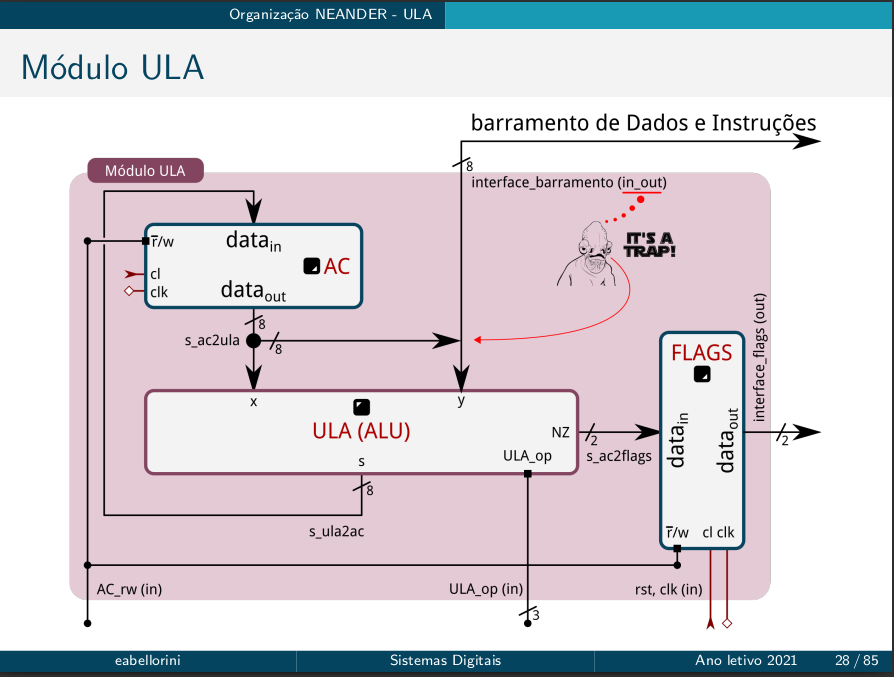
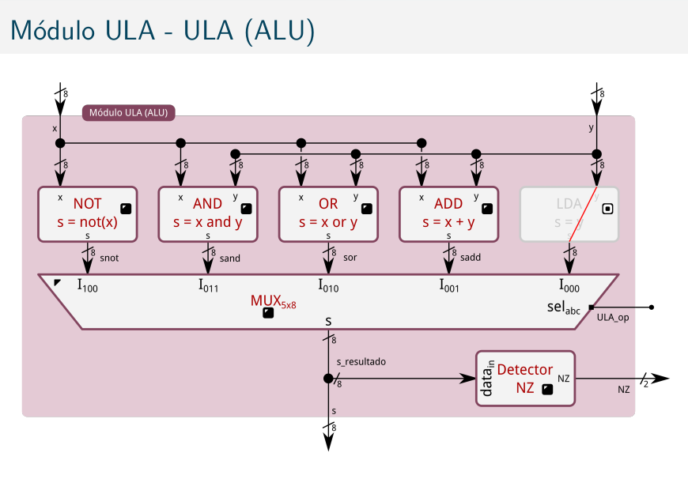

# Unidade Lógica Aritimética

## intern components

## there are 3 main components
- 2 registrators (flags, data)
- 1 ula
  
## what does it do?
- calculus and arithmetic
- 2 values: x and y
- x comes from data, y comes from memory
- op is the operator (which operator it is?)

## how to implement it?
- bit_vectors (7 downto 0)

## caution!
- quando reseetar o neander, a flag Z precisa estar em 1
- Z impedância (o valor não importa, deixa passar qualquer coisa, eletrônica)

